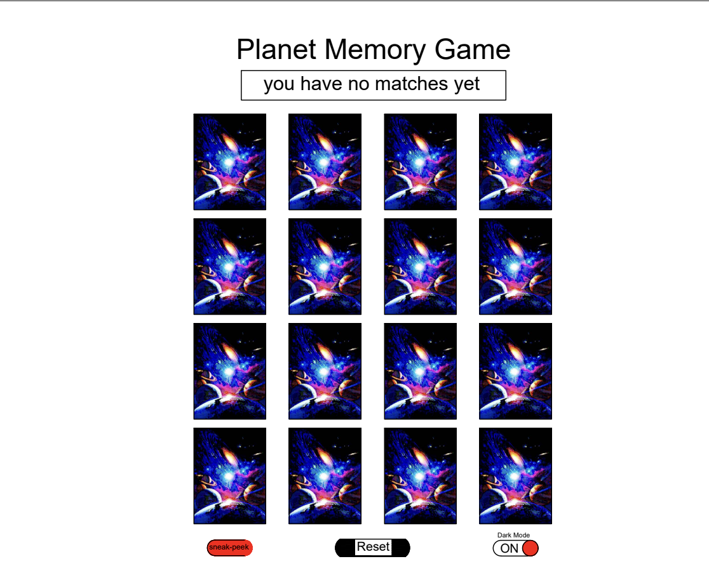
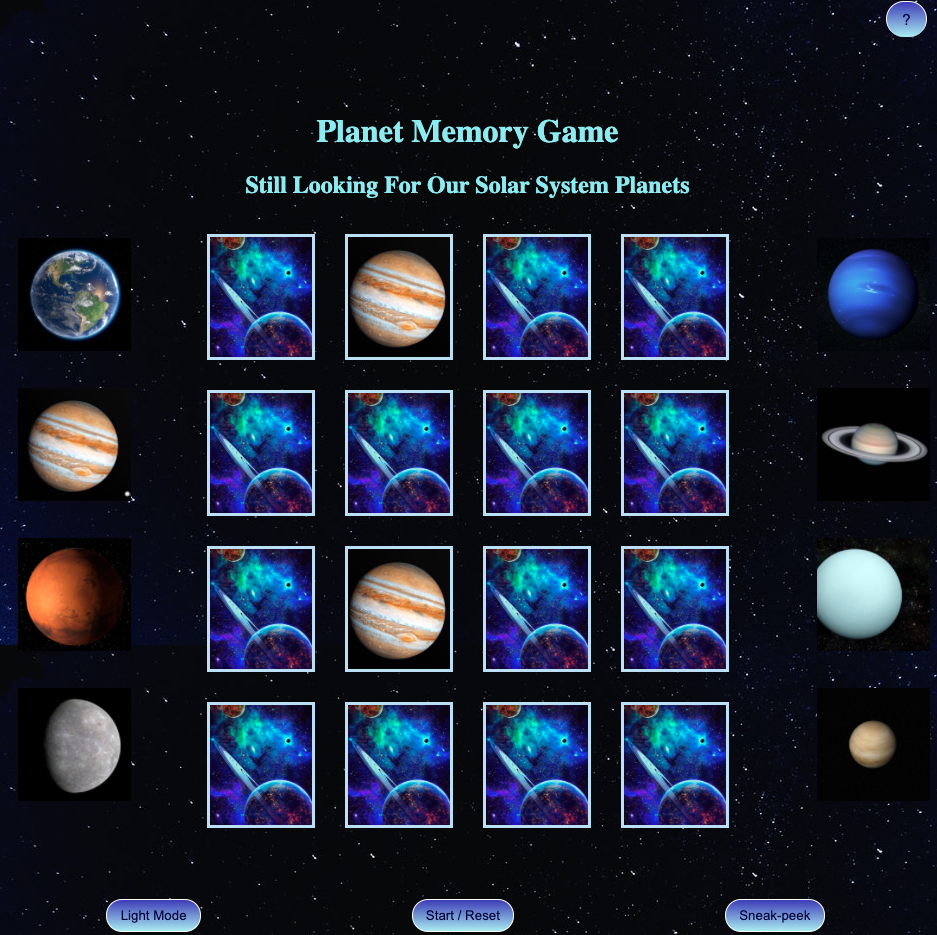
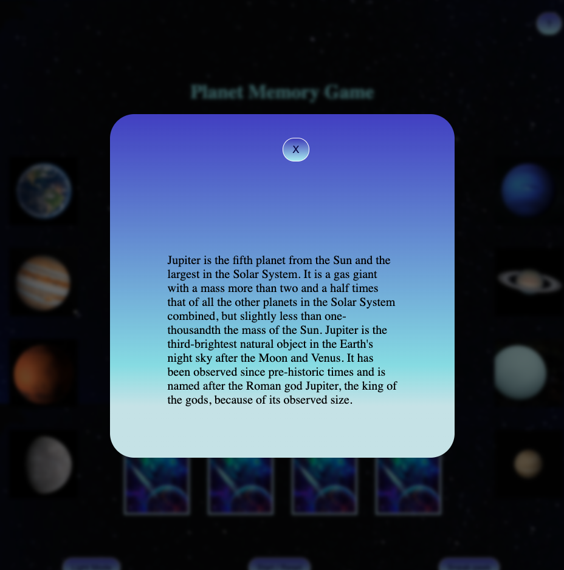

# Planet Memory Game

## description

a browser-based Matching memory game where you have randomly placed cards,
that you'll have to click on to see whether you got a match, when you match all the cards 2 by 2, you win the Game
there is also a modals that are attached to the planets' pictures, when you click on a specific planet you l get a pop-up with information an=bout that specific planet

click [here](https://narimenmokrani1.github.io/Memory-Game/) to go play the Game

## **User Stories** :

### **MVP :**

- As a user, I want to be able to have multiple tries to get the right matches.
- As u user, I want to be able to click on the first card and have it displayed on the screen until I click the 2nd card.
- As a user, I want to have a glimpse at the two unmatched cards, before they go back to their position.
- As a user, I want to have a winning message.
- As a user, I want to see the two matched cards displyes on the screen and not flipped back once matched.
- AS a user, I want to be able to restart the game
- sneak-peek button that allows the player to see all cards for few seconds

## **wireframes :**

## **The Browser Game:**

## **About modals:**

## **Stretch Goals :**

- Timer that counts backward, which will give the player a certain time to match, otherwise they loose
- have a meessage displayed with the number of unmatches.
- add a 3D affect for when the cards turn.
- sound affect for when the cards turn, and when game is over.

## **Resources **

### pictures :
- Wikipedia
- WallpaperAccess

### code:

- [cards shuffle](//https://javascript.info/task/shuffle)
- [stack overflow](https://stackoverflow.com/)
- [MDN web docs](https://developer.mozilla.org/en-US/docs/Web/JavaScript)
